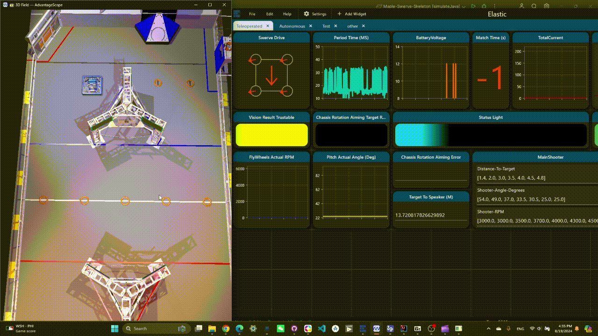
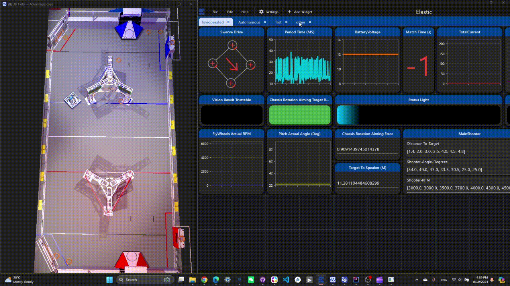

# 🍁 Swerve Skeleton

---

6328 ([TBA](https://www.thebluealliance.com/team/6328/2024) | [Github](https://github.com/mechanical-advantage) | [Website](http://team6328.org/))'s [Advanced Swerve Drive Project](https://www.chiefdelphi.com/t/advantagekit-2024-log-replay-again/442968/54#advanced-swerve-drive-project-2) with enhanced physics simulation.

> 🙏 We extend our deepest appreciation to [Team 6328](https://www.littletonrobotics.org/) for their [open source project](https://github.com/Mechanical-Advantage), which have made this project possible.
>
> ⚖️ This project is based on an example from [AdvantageKit](https://github.com/Mechanical-Advantage/AdvantageKit/), which is under the [GPLv3](https://www.gnu.org/licenses/gpl-3.0.en.html#license-text) license. All teams are welcome to use it, provided that you adhere to the [Advantage Kit License](./AdvantageKit-License.md).

## Simulation Details

### The Field has Collision Space
The greatest distinction of the project is the implementation of [dyn4j](https://github.com/dyn4j/dyn4j), an open-source java physics engine, which enables us to add a collision detection for everything on the field, including obstacles, robots and game pieces.

### Swerve-Drive Physics Simulation
Fine-tuned with data measured in our training field, the swerve drive simulation provides an incredibly realistic drivetrain characteristics.
It simulates the behavior of each individual swerve module using [WPILib DCMotorSim](https://github.wpilib.org/allwpilib/docs/release/java/edu/wpi/first/wpilibj/simulation/DCMotorSim.html) and use the data from 4 modules together to simulate the force on the drivetrain. 
[[Source Code](https://github.com/Shenzhen-Robotics-Alliance/Maple-Swerve-Skeleton/blob/main/src/main/java/frc/robot/utils/CompetitionFieldUtils/Simulations/SwerveDriveSimulation.java)]

### Game Pieces and Intake Simulation
In our simulation, game pieces on the field has collision spaces and can interact with the robot.
It also allows teams to simulate a fixed intake module on the robot that grabs a game pieces whenever in-contact.
[[Source Code](https://github.com/Shenzhen-Robotics-Alliance/Maple-Swerve-Skeleton/blob/main/src/main/java/frc/robot/utils/CompetitionFieldUtils/Simulations/IntakeSimulation.java) | [Example Code](https://github.com/Shenzhen-Robotics-Alliance/5516-2024-OffSeason/blob/main/src/main/java/frc/robot/subsystems/intake/IntakeIOSim.java)]

### Opponent Robots Simulation
Simulated robots that can either be controlled by a gamepad to play defense or follow pre-stored cycle paths.
Just as real robots, opponent robots have collision spaces.
This allows drivers to practice defense/offense.
[[Source Code](https://github.com/Shenzhen-Robotics-Alliance/Maple-Swerve-Skeleton/blob/main/src/main/java/frc/robot/utils/CompetitionFieldUtils/Simulations/OpponentRobotSimulation.java)]

### Odometry Simulation

Odometry Simulation with realistic characteristics such as skidding and the IMU drifts.  
[[Source Code](https://github.com/Shenzhen-Robotics-Alliance/Maple-Swerve-Skeleton/blob/main/src/main/java/frc/robot/subsystems/drive/IO/ModuleIOSim.java) | [Video](https://youtu.be/ersRWIzC0zc)]

### Vision Simulation with
Built Upon [PhotonLib Camera Sim](https://docs.photonvision.org/en/latest/docs/simulation/simulation.html), our vision simulation behaves exactly the same as a real vision system
The system uses April Tags to position the robot on field, and teams can tune the system without a field

We also Provide a convenient feature that generates [Advantage Scope Fix Camera Config](https://github.com/Shenzhen-Robotics-Alliance/Maple-Swerve-Skeleton/blob/main/src/main/java/frc/robot/utils/CustomConfigs/PhotonCameraProperties.java) automatically, which allows you to see the camera's view in advantage scope with easy steps to set up, [Source Code](https://github.com/Shenzhen-Robotics-Alliance/Maple-Swerve-Skeleton/blob/main/src/main/java/frc/robot/utils/CustomConfigs/PhotonCameraProperties.java)

## Getting Started

